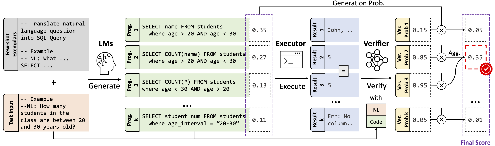

# LEVER: Learning to Verify Language-to-Code Generation with Execution
<p align="left">
    <a href="https://img.shields.io/github/license/niansong1996/lever">
        
    </a>
    <a href="https://img.shields.io/github/last-commit/HKUNLP/Binder?color=green">
        
    </a>
    <a href="https://img.shields.io/badge/PRs-Welcome-red">
        
    </a>
    <br/>
</p>

Code for paper "[LEVER: Learning to Verify Language-to-Code Generation with Execution](https://arxiv.org/abs/2302.08468)". LEVER is a simple method that improves the code generation ability of large language models trained on code (CodeLMs), by learning to verify and rerank CodeLM-generated programs with their execution results. LEVER + Codex (*code-davinci-002*) achieves new SOTA results on the [Spider](https://yale-lily.github.io/spider), [WikiTableQuestions](https://github.com/ppasupat/WikiTableQuestions), [GSM8k](https://github.com/openai/grade-school-math), and [MBPP](https://github.com/google-research/google-research/tree/master/mbpp) datasets.



## Updates
- **2023-07-05**: Check out our [**online demo**](https://huggingface.co/spaces/niansong1996/lever-demo) on Huggingface Space!
- **2023-07-04**: (Trained) Model weights for Codex on all 4 datasets are available on Huggingface, check the [*Model Checkpoints*](https://github.com/niansong1996/lever#model-checkpoints) section!
- **2023-07-03**: Initial code release
- **2023-04-24**: LEVER is accepted to ICML'23!

## Setup
### Installation
(Recommended) Create a new conda environment
```bash
conda create -n lever python=3.8
conda activate lever
```
Install the dependencies
```bash
pip install -r requirements.txt
```
> **NOTE**: all of the pipelines are only tested on Linux machines, you may need to build your own `tree-sitter` parsers if a different platform is used.

### Data
> We share only the verification data, which is essential to reproduce our results, under the [CC-BY-NC 4.0](https://creativecommons.org/licenses/by-nc/4.0/) license. For the original datasets, please refer to their own pages. 

Download the data from [here](https://drive.google.com/file/d/1pxFSnQVZKTJ9uAeZWiMopMbP8pdWK7GI/view?usp=sharing) and create a `data` folder:
```bash
cd lever
mkdir data
cd data
unzip lever_verification_data.zip
```
After this, make sure your `data` directory looks something like this:
```
data
|-- gsm8k
|   |-- ...
|-- mbpp
|   |-- ...
|-- spider 
|   |-- ...
|-- wikitq
|   |-- wikitq_codex_verification_dev.jsonl
|   |-- wikitq_codex_verification_test.jsonl
|   |-- wikitq_codex_verification_train.jsonl
```

### Optional Setups
(For Codex) Set up OpenAI API key. Either put this line in your `~/.bashrc` (or equivalent), or add this line to every inference commands:
```bash
export OPENAI_API_KEY=<your key, should start with "sk-">
```

(For experiment logging) Prepend `export EXP_NAME=<your exp name>` to the python commands to log to `wandb`, for example:
```bash
export EXP_NAME=lever-reproduce-mbpp; 
```
But you may need to setup a W&B account first (you may follow the instructions [here](https://docs.wandb.ai/ref/cli/wandb-login)). Then change the following lines in `trainer.logger+` fields of the `yaml` config file you would like to run:
```yaml
entity: <your-user/org-name>
project: <your-project-name>
```

(Common error) At any point, if you met with the Python import problem (e.g., `ModuleNotFoundError`), try doing this in the main (`lever`) directory:
```bash
export PYTHONPATH=`pwd`
```

## Usage

**If you would like to:**
* Try out LEVER or look at some more examples, we highly recommend you to visit our [Demo Page](https://huggingface.co/spaces/niansong1996/lever-demo);
* Reproduce our results on all datasets on *preprocessed* datasets, first check the [Data](https://github.com/niansong1996/lever#data) section to download the data, then see the [Reproduce](https://github.com/niansong1996/lever#reproduce) section;
* Apply *trained* LEVER on one of the four datasets, but to the outputs of different code LLM (e.g., GPT-4, ChatGPT, StarCoder), follow the instructions at [New LLMs](https://github.com/niansong1996/lever#new-llms) section;
* Apply LEVER to a different dataset, this requires generating training data and re-train LEVER from scratch, please follow the instructions at [Training](https://github.com/niansong1996/lever#new-datasets) section.

### Model Checkpoints
For easy reproducibility, we share the weights of all the trained models for all 4 datasets on the huggingface model hub:
* LEVER for Codex on Spider: [*niansong1996/lever-spider-codex*](https://huggingface.co/niansong1996/lever-spider-codex)
* LEVER for Codex on WikiTQ: [*niansong1996/lever-wikitq-codex*](https://huggingface.co/niansong1996/lever-wikitq-codex)
* LEVER for Codex on GSM8K: [*niansong1996/lever-gsm8k-codex*](https://huggingface.co/niansong1996/lever-gsm8k-codex)
* LEVER for Codex on MBPP: [*niansong1996/lever-mbpp-codex*](https://huggingface.co/niansong1996/lever-mbpp-codex)

> If you would like to use the trained model weights for InCoder and CodeGen models, please open a feature request [here](https://github.com/niansong1996/lever/issues).

### Inference
If you would like to apply trained LEVER models to existing datasets, to existing models, or maybe even outputs of different code LLMs*, you only need to load the pretrained weights of LEVER and run inference.

> *: As shown in Table 8 of the [paper](https://arxiv.org/abs/2302.08468), transfer learning works surprisingly well.

#### Reproduce
The easiest way to reproduce our results is to run the trained models on the prepared datasets used in the paper.
After obtaining the data and put them in the specific locations as described in the [Data](https://github.com/niansong1996/lever#data) section, run the following commands with `<dataset>=spider|wikitq|gsm8k|mbpp`
```bash
python finetuning/trainer.py validate --config finetuning/training_configs/verification/<dataset>_verification.yaml --trainer.accelerator gpu --trainer.gpus 1
```
Of course, also feel free to modify the `yaml` config file directly, all the fields should be self-explanatory.

#### New LLMs
To apply LEVER to new LLMs on existing datasets, for each example, you first need to sample candidate programs with the new LLMs. We have some example `yaml` on how you can do this for GSM8K for `Codex`, `InCoder` and `CodeGen` models in `finetuning/training_configs/few_shot/`.

To add a new LLM in the few-shot generation pipeline, you would need to add it in `finetuning/lightning_modules/models/seq2seq_model_util.py`
```python
    ...
    elif model_name.startswith("codex-"):
        ...
    elif model_name == ###### Add your model here ##########
        """Initialize and return the tokenizer and the model """
        ######## End adding model ##############
    else:
        print(f"unknown model: {model_name}")
        raise NotImplementedError
```
Also don't forget to update the two helper functions accordingly:
```python
def is_model_gpt_style(name: str) -> bool:
    ...

def is_encoder_only_model(name: str) -> bool:
    ...
```

After all this is done, you should be able to run few-shot generation with your own model like this:
```bash
python finetuning/trainer.py validate --config finetuning/training_configs/few_shot/<your_new_llm_config>.yaml
```

### Training
While LEVER works well when it's trained with the outputs from another LLM and apply it to a different LLM **for the same dataset**, if you would like to apply LEVER to a different dataset, you may need to implement a new dataset under our framework, generate your own training data and train your own LEVER model. 

While it will be too verbose to give a full tutorial of all these parts, we point you to the different parts of the repo and hopefully you can follow those examples to build such a pipeline for a new dataset.

#### Implement new dataset class for few-shot generation
First check out the examples at `finetuning/lightning_modules/datasets`, more specifically, we suggest look at these two classes `FewShotMathQADataset` and `FewShotMathQADataModule` in `finetuning/lightning_modules/datasets/mathqa_reader.py` and the functions you need to override.

#### Running few-shot generation
You would need to run few-shot generation on both the training data and dev/test data for your own dataset, the general command should be like:
```python
python finetuning/trainer.py validate --config finetuning/training_configs/few_shot/<your_new_dataset_config>.yaml
```

#### Implement new dataset class for verification
Now that you have the candidate programs for your own dataset, you need to implement another two dataset classes for verification, for this, check out `MathQAEndVerificationDataset` and `MathQAEndVerificationDataModule` in `finetuning/lightning_modules/datasets/mathqa_reader.py` for examples. 

#### Train LEVER
Next, you will train LEVER with the training data you just generated, with command like:
```python
python finetuning/trainer.py fit --config finetuning/training_configs/verification/<your_new_dataset_config>.yaml
```

#### Run LEVER on your dev/test data
By default, if you put the path of the dev data in the `yaml` file of `<your_new_dataset_config>.yaml` in your previous command, you should see the validation results between each epochs of training, but you can also just run it like:
```python
python finetuning/trainer.py validate --config finetuning/training_configs/verification/<your_new_dataset_config>.yaml --model.load_ckpt_file <path_to_ckpt>
```

## References
Part of the code adapted from [https://github.com/Yale-LILY/NLP4Code](https://github.com/Yale-LILY/NLP4Code) (Apache-2.0 License) and [https://github.com/microsoft/TraceCodegen](https://github.com/microsoft/TraceCodegen) (MIT License). 

If you use the code or data in this repository, please cite:
```bib
@inproceedings{ni2023lever,
  title={Lever: Learning to verify language-to-code generation with execution},
  author={Ni, Ansong and Iyer, Srini and Radev, Dragomir and Stoyanov, Ves and Yih, Wen-tau and Wang, Sida I and Lin, Xi Victoria},
  booktitle={Proceedings of the 40th International Conference on Machine Learning (ICML'23)},
  year={2023}
}
```

